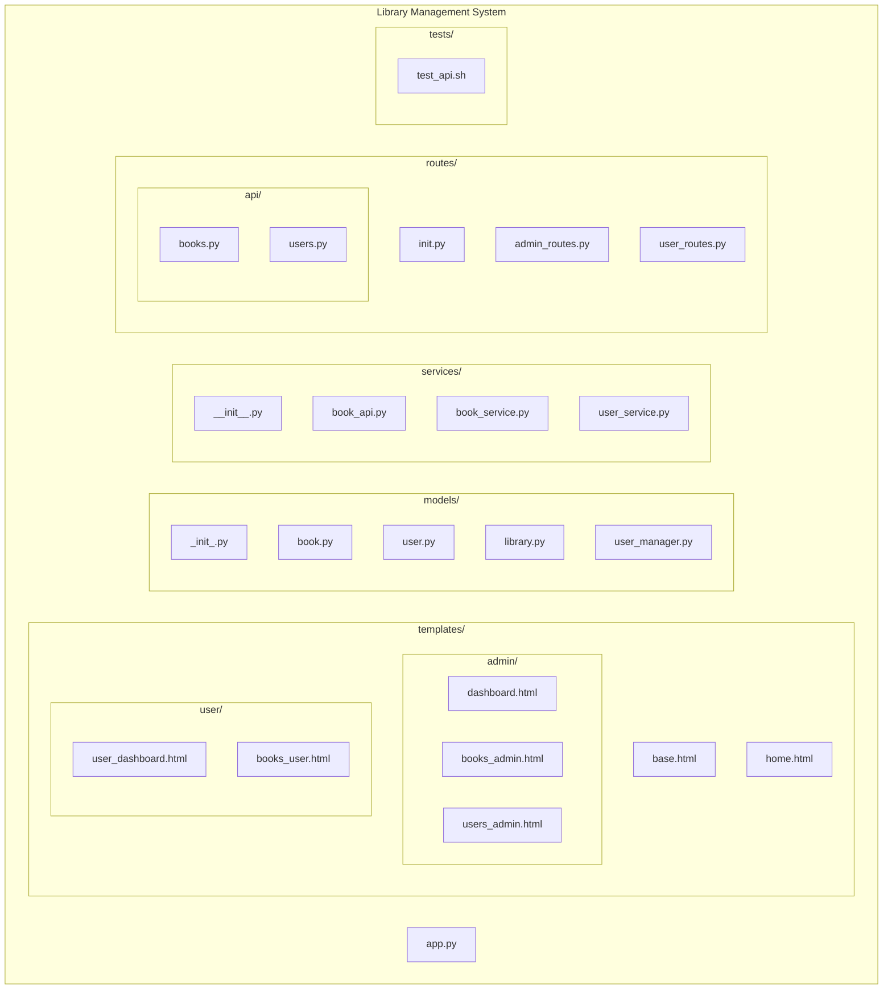

# Library Management System

A full-stack Library Management System built with Flask and TailwindCSS for styling.
This project demonstrates server–client separation with both API endpoints (for programmatic access) and a web-based UI (for users and librarians).

## Tech-Stack
<ol><li>Python (Flask)</li><li>HTML</li><li>CSS (Tailwind)</li><li>curl (for API testing)</li></ol>

## Project Structure

### Image of the Project Structure

<image src="Project-Structure.png" width=350px height=700px>

## Features
<ol>
<li>
<ul>Book Management
<li>Add, view, search, and delete books</li>
<li>Track availability (borrowed vs available)</li>
</ul>
</li>

 

<li>
<ul>User Management
<li>Add, view, and delete users</li>
<li>Track borrowed books per user</li>
</ul>
</li>

 

<li>
<ul>Borrow & Return System
<li>Users can borrow available books</li>
<li>Return borrowed books and free them up for others</li>
</ul>
</li>

 

<li>
<ul>API-Endpoints
<li>REST-style JSON APIs for books and users</li>
<li>Tested via <code>curl</code> and <code>test_api.sh</code> script</li>
</ul>
</li>

 

<li>
<ul>Admin Interface
<li>Dashboard with total books and users</li>
<li>Manage books and users through forms</li>
</ul>
</li>

 

<li>
<ul>User Interface
<li>User dashboard with profile info</li>
<li>Browse available books</li>
<li>View borrowed books</li>
</ul>
</li>
</ol>

## Workflow
<ol><li>Server initialization

<ul>
<li><code>app.py</code>sets up Flask and configures global singletons:</li>
<li><code>Library</code> manages all the books</li>
<li><code>UserManager</code> manages all the users</li>

</ul>

</li> 

<li>Models Layer (models/)

<ul>
<li>Book - represents a single book (title, author, ISBN, etc.)</li>
<li>Library – manages a collection of books (add, delete, borrow, return)</li>
<li>User – represents a library user (profile + borrowed books)</li>
<li>UserManager – manages all users</li>

</ul>

</li> 

<li>Routing Layer(routes/)

<ul>
<li>API Routes <code>/api/...</code> - JSON endpoints for programmatic access
<ul><li><code>/api/books</code> - CRUD Operations on books</li><li><code>/api/users</code> - CRUD Operations on users & borrow/return actions</li></ul>
</li>
<li>Admin Routes <code>(/admin/...)</code> – librarian dashboard & book/user management</li>
<li>User Routes <code>(/user/...)</code> – user dashboard, profile info, browse/borrow books</li>

</ul>

</li> 

<li>Services Layer(services/)

<ul>
<li>Placeholder for integrating external APIs (e.g., Google Books, OpenLibrary)</li>
<li>Can extend functionality without touching core models</li>
</ul>

</li> 

<li>Frontend(templates/ + static/)</li>

<ul>
<li>Admin UI – dashboards for librarians to manage books and users</li>
<li>User UI – dashboards for users to browse and borrow books</li>

</ul>

 

<li>Testing(tests/)

<ul>
<li><code>test_api.sh</code> runs a sequence of curl requests<ul><li>Add users/books</li><li>Borrow/return flow</li><li>Check admin and user pages</li></ul></li>
<li>Confirms both API and HTML endpoints are functional</li>

</ul>

</li></ol>

## Future Improvements
<ol><li>Add user authentication & roles (librarian vs user)</li><li>Improve UI with Tailwind components (modals, tables, forms)</li><li>Extend services with external APIs (Google Books, OpenLibrary)</li></ol>

## TL;DR

A Flask-based Library Management System that supports CRUD operations on Books and Users, along with Borrow & Return functionality, accessible via REST API and a simple web interface.

